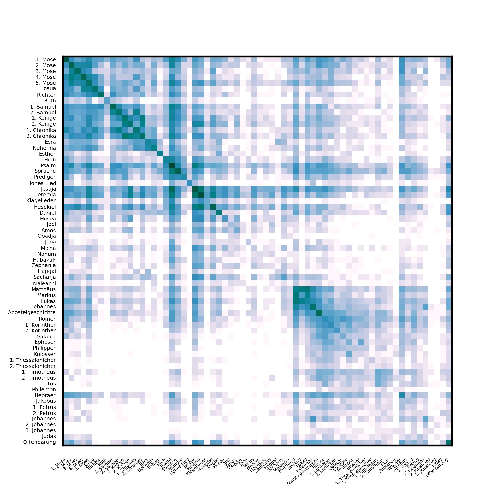

bible_cross_references
======================

Data, scripts and plots for Bible cross references. 

The file data/all_cross_refs_abs.csv is a 66 x 66 matrix containing the absolute number of 
cross references between the bible books. For example, the sixth value of the first row would 
be the number of cross references FROM Genesis TO Joshua. 

The references are from the online version of the New World Translation (original version, not the 
2014 revision) published by Jehovah's Witnesses on jw.org. 

Plotting of the heatmap is done with matplotlib and numpy. 

